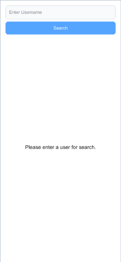

This is a [Next.js](https://nextjs.org) project bootstrapped with [`create-next-app`](https://nextjs.org/docs/app/api-reference/cli/create-next-app).

## Screenshot




## Tech Stack

- Next.js
- React
- TypeScript
- Tailwind CSS
- PWA

## Folder Structure

- `/__test__` — General tests
- `/app` — App routes
- `/components` — Reusable components
- `/lib` — Utility functions and libraries
- `/public` — Static files

## Getting Started
### 📥 1. Clone the Repository
```bash
git clone https://github.com/bamaarintoko/notgithub.git
```
### 📂 2. Navigate to the Project Directory
```bash
cd your-repo-name
```
### 📦 3. Install Dependencies
```bash
npm install
# or
yarn install
```
### 🧪 7. Run Tests (Optional)
```bash
npm test
# or
yarn test
```
### 💻 5. Run the Development Server
```bash
npm run dev
#or
yarn dev
```
### 🌐 6. Open in Browser
Go to http://localhost:3000 to view the app in your browser.


You can start editing the page by modifying `app/page.tsx`. The page auto-updates as you edit the file.

This project uses [`next/font`](https://nextjs.org/docs/app/building-your-application/optimizing/fonts) to automatically optimize and load [Geist](https://vercel.com/font), a new font family for Vercel.

## Learn More

To learn more about Next.js, take a look at the following resources:

- [Next.js Documentation](https://nextjs.org/docs) - learn about Next.js features and API.
- [Learn Next.js](https://nextjs.org/learn) - an interactive Next.js tutorial.

You can check out [the Next.js GitHub repository](https://github.com/vercel/next.js) - your feedback and contributions are welcome!

## Deploy on Vercel

The easiest way to deploy your Next.js app is to use the [Vercel Platform](https://vercel.com/new?utm_medium=default-template&filter=next.js&utm_source=create-next-app&utm_campaign=create-next-app-readme) from the creators of Next.js.

Check out our [Next.js deployment documentation](https://nextjs.org/docs/app/building-your-application/deploying) for more details.
